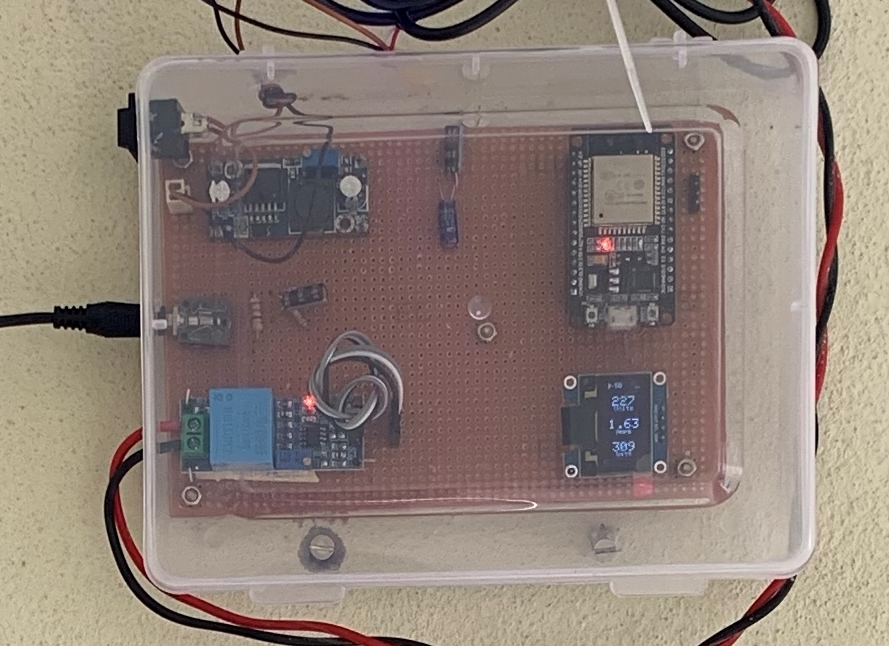

# Home Energy Monitor

For Flashing, When Arduino IDE showing compiling, Press EN + Boot and Release EN When showing 'Connecting...', once it starts flashing you may release 'Boot' as well.

## References
- https://github.com/espressif/esptool/wiki/ESP32-Boot-Mode-Selection
- https://docs.espressif.com/projects/esp-idf/en/latest/esp32/get-started/establish-serial-connection.html
- https://randomnerdtutorials.com/installing-the-esp32-board-in-arduino-ide-windows-instructions/
- https://learn.openenergymonitor.org/electricity-monitoring/ct-sensors/interface-with-arduino
- https://community.createlabz.com/knowledgebase/wireless-energy-monitoring-system-using-esp32-with-blynk-mobile-app/?unapproved=155&moderation-hash=bfb68ff67d5e8b5ec20f2f341ea2e23e#comment-155
- https://lastminuteengineers.com/oled-display-arduino-tutorial/
- https://learn.openenergymonitor.org/electricity-monitoring/ctac/how-to-build-an-arduino-energy-monitor
- https://github.com/Savjee/home-energy-monitor
- https://github.com/Savjee/EmonLib-esp32
- https://savjee.be/2020/01/multitasking-esp32-arduino-freertos/
- https://savjee.be/2020/02/home-energy-monitor-v2/
- https://github.com/espressif/arduino-esp32
- https://www.espressif.com/sites/default/files/documentation/esp32-wroom-32_datasheet_en.pdf
